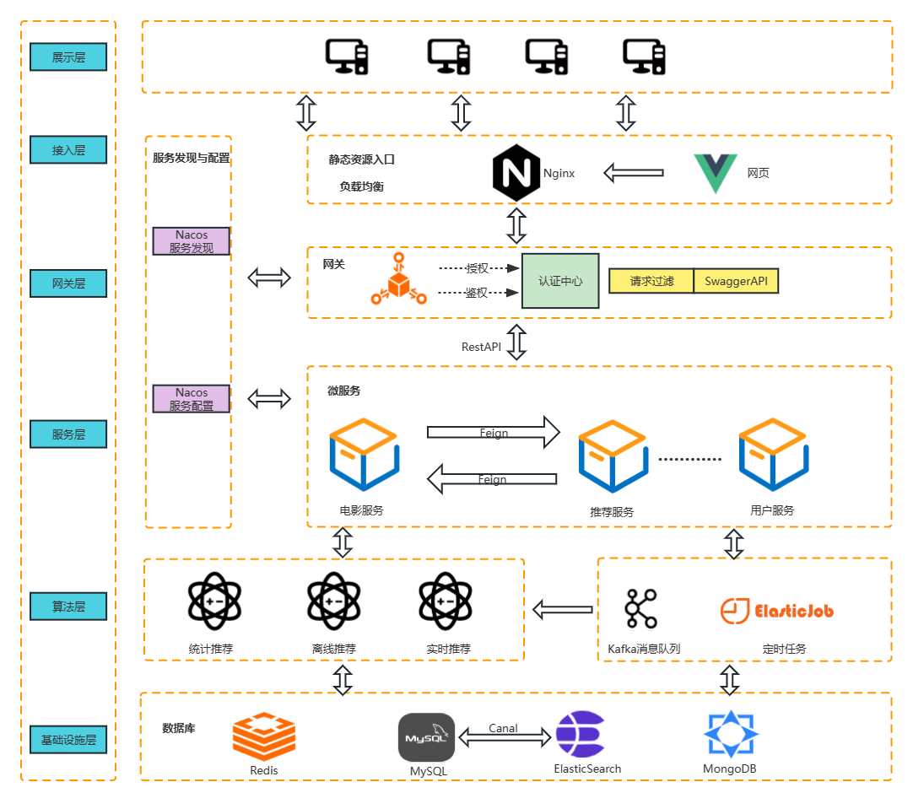

# MovieSystem-Server
电影推荐系统-后端

项目演示视频地址：https://www.bilibili.com/video/BV1tm4y1h7EQ/

## 系统设计

### 架构设计



### 数据处理流程


### 服务拆分

|    服务名    |                 功能描述                  |
| :----------: | :---------------------------------------: |
|   搜索服务   | 使用ElasticSearch实现电影的多字段模糊搜索 |
|   推荐服务   |   使用Spark实现电影的离线推荐和实时推荐   |
| 电影详情服务 |       获取电影的具体信息、评论评分        |
|   用户服务   |              用户登录、注册               |
| 短信邮件服务 |         使用短信或邮件发送验证码          |
|   网关服务   |              请求分发、鉴权               |

### 数据库设计


## 数据库优化

MySQL-5.7.22

### 索引优化

#### movie_reviews

表数据量：1050170

对评论表中的douban_id字段加上普通索引，适用场景：用户查看某电影的评论

```sql
SELECT
	review_id,
	douban_id,
	…… 
FROM
	movie_recommendation.movie_reviews 
WHERE
	douban_id = 1291543
ORDER BY
	user_movie_rating_agree DESC,
	user_movie_rating_time DESC
```


| 使用索引前（10次平均/ms）  | 使用索引后（10次平均/ms） |
| :------------------------: | :-----------------------: |
| 58ms（第一次查询时4.434s） |           18ms            |

第一次很慢的原因，全表扫描；

第二次之后快是由于MySQL将查询语句和结果放到了缓存中

#### movie_detail

表数据量：8715

对电影表中的title字段加上普通索引，适用场景：用户填写关键字，查询相关电影的详情

```sql
SELECT
	douban_id,
	title,
 	……
FROM
	movie_recommendation.movie_detail 
WHERE
	title like '星际%';
```

| 使用索引前（10次平均/ms） | 使用索引后（10次平均/ms） |
| :-----------------------: | :-----------------------: |
|           42ms            |           22ms            |

### 电影搜索优化——ElasticSearch

需求：

用户输入一些关键字去搜索，返回在电影名、演员、导演与之匹配的结果。

#### 使用MySQL

```sql
SELECT
	douban_id,
	title,
 	……
FROM
	movie_recommendation.movie_detail 
WHERE
	title like '%星际%' or casts like '%星际%' or directors like '%星际%';
```

问题：

- 平均用时：56ms
- 使用以%开头的like查询，无法使用索引，走**全表扫描**；
- 返回的结果较多时，无法判断那个是更符合搜索条件的更优结果！

#### 使用ES

```json
{
  "query": {
    "multi_match": {
      "query": "星际",
      "minimum_should_match": "80%", //查询结果至少要包含【分次数*80%】向下取整的数量
      "fields": ["title^5","casts^3","directors^2"] // 查询字段并添加权重
    }
  }
}
```


结果：

- 平均用时：7ms，提升巨大！
- 优势：

- - 查询结果默认是**Score降序**的，即匹配度的降序；
  - 可以给字段**设置权重**，比如这里就给title设置较高的权重，说明匹配度中title字段的影响要稍大一些！

#### 项目中使用ES存在的问题

问题：

- ES主要用来做搜索，不适合做增删改，但是我们的表中的字段如评分（ratingScore）、评分数（ratingScore）是在**不停变化**的;
- 评分一般都是在MySQL中操作，但我又不想格外写一段逻辑去操作ES！

解决方案：

- 使用了**Canal**，MySQL中数据变化时**增量同步**到ES中
- canal版本：1.1.5

配置Canal中遇到的问题：

- 配置adapter的application.yml文件

- - outerAdapters的name要指明es6还是es7；

  - mode为rest时hosts要加http://

  - 注意yml文件格式

    

- 配置adapter的映射文件时：

- - dataSourceKey、outerAdapterKey、destination、groupId要和上面的application.yml对应；
  - _id和pk：_id是ES自动生成时需要指明pk为一个唯一的主键


### 大表优化

评分表（movie_user_ratings）和评论表（movie_reviews）中存放了所有电影的评分和评论，其中的数据在不断增长，并且很容易增长到一个很夸张的地步，因为一门热门电影就可能有几百万的评分数，如下所示。因此，只用单表存储数据量会非常之大。


### 简单查询

这里先往这两张表中各插入2000w条数据，先观察查询性能下降情况。

简单查询，能用到索引下推:

```sql
SELECT
	review_id,
	douban_id,
	…… 
FROM
	movie_recommendation.movie_reviews 
WHERE
	douban_id = 1291543
ORDER BY	
	user_movie_rating_agree DESC,
	user_movie_rating_time DESC
```

| 数据量：105w | 数据量：2100w |
| :----------: | :-----------: |
|     18ms     |     21ms      |

可见性能并没有下降的很厉害，我认为原因是：IO次数并没有增加！

对于二级索引，B+树中非叶子节点中占20+6+4=30字节，叶子节点占20+4=24字节，每页可装16*1024/24=682条记录，可装16*1024/30=546个页号，3层B+树可装：546*546*642=1.9e，远大于2000w的数据量，3次IO查到主键，在回表查询完整记录。

对于主键索引，每条记录约210字节，主键+指针=20+6=26字节，每页可装16*1024/26=630个页号，每页可装16*1024/210=78条记录，3层B+树可装630*630*78=3000w，大于目前的2000w数据量，也就是还可以3次IO查到完整数据，和原来100w时的数据量一样。如果最终数据量超过了3000w，那么需要4层B+树来存储，会增加IO次数，性能才会下降。

### 复杂查询

```sql
SELECT
	douban_id,
	sum( CASE WHEN user_movie_rating > 40 THEN 1 ELSE 0 END ) / count( douban_id ) AS positive
FROM
	movie_reviews 
GROUP BY
	douban_id;
```

| 数据量：105w | 数据量：2100w |
| :----------: | :-----------: |
|    16.3s     |     498s      |

使用**mycat2**对评分表（movie_user_ratings）和评论表（movie_reviews）进行**分库和分表**。

分库分表策略：

使用mycat的**mod_hash**方法，以**douban_id**作为分库键和分表键。

分成2个库，分别在两个虚拟机的MySQL中（配置了主从复制和读写分离），每个库中10张表。

使用mycat分库分表后，计算好评率:

```sql
SELECT
	douban_id,
	sum( CASE WHEN user_movie_rating > 40 THEN 1 ELSE 0 END ) / count( douban_id ) AS positive
FROM
	movie_reviews 
GROUP BY
	douban_id;
```

| 数据量：105w |    数据量：2100w     |
| :----------: | :------------------: |
|    1.462s    | 未测试，磁盘空间不够 |

## 推荐算法设计

### 离线推荐

​	离线推荐算法计算的是用户的所有历史数据，十分耗时，难以做到实时响应，因此需要离线运行，并且需要按时运行以更新推荐结果集。离线推荐算法反映的是用户整个历史的电影喜好。

##### 基于ALS（交替最小二乘法）的隐语义模型推荐算法

​	先要找出该用户的所有未评分电影，两两计算此电影与任一未评分电影间的相似度，得到电影间的相似度列表并将其降序排列，选取相似度较高的未评分电影即可作为该电影的相似电影列表。


##### 

### 实时推荐

实时计算与离线计算在推荐系统上的不同之处在于**实时计算推荐结果反映最近一段时间用户近期的偏好**，而**离线推荐结果反映用户历史总体的偏好**。

设计实时推荐算法有三点原因：

1. 用户的喜好并不是一成不变的，可能用户在一段时间内喜欢“爱情”类电影，在另一段时间内认为“爱情”类电影电影枯燥且乏味，转而喜欢“科幻”类电影。如果继续使用离线推荐算法，系统仍会为用户推送许多“爱情”类电影。因此，设计实时推荐算法能让系统只关注用户近期的电影喜好，使推荐结果更加人性化、精准化。
2. 由于本系统的用户评分表的数据量十分庞大，有100多万条用户评分数据，如果继续使用离线推荐算法，每来一条评分数据就要重新计算并生成新的ALS模型。这无疑会造成巨大的资源浪费和冗长的计算耗时，难以满足用户在秒级或毫米级获取新推荐列表的需求，是得不偿失的。
3. 用户在短时间内一般只会对极少量电影评分，当用户的评分矩阵没有多大变化时，如果继续使用离线推荐算法，得出的推荐结果也会与之前相差无几。这样就会给用户造成推荐结果一直没有变化的假象，大大降低了用户的使用体验。


